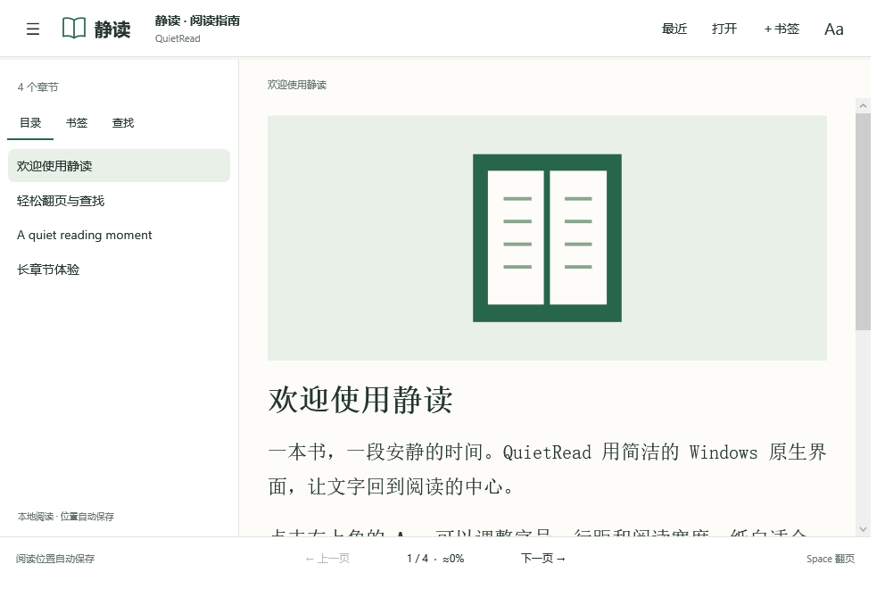

# QuietRead · 静读

[](https://github.com/lhy8888/epub/actions/workflows/ci.yml)
[](https://github.com/lhy8888/epub/actions/workflows/security.yml)
[](LICENSE)
[](#使用)

一个面向 Windows 11 的本地 EPUB 阅读器。使用 .NET 10 WPF 原生桌面控件，按需读取章节，将书籍转换为受控的文字、图片和排版元素。

**离线阅读 · 无账号 · 无广告 · 普通用户权限 · 源码无第三方 NuGet 包**



*在 GitHub Windows runner 中打开项目原创示例书的实际 WPF 界面。*

## 下载

- **最新开发构建**：打开 [Build and checks](https://github.com/lhy8888/epub/actions/workflows/ci.yml)，选择 `main` 分支最近一次成功运行，在页面下方 **Artifacts** 下载 `QuietRead-Windows-x64`。下载 Actions 产物需要登录 GitHub；产物保存 30 天。
- 解开 Actions 下载包，取出其中的 `QuietRead-版本-Windows-x64.zip`，再将这个便携 ZIP **完整解压**后运行。
- **正式版本**：[Releases](https://github.com/lhy8888/epub/releases)。维护者推送与项目版本一致的 `vX.Y.Z` 标签后，自动编译、测试并发布 ZIP 与 SHA-256。首次上传仅生成开发构建。
- **校验**：便携 ZIP 旁的 `.zip.sha256` 提供整包 SHA-256；解压目录内的 `SHA256SUMS.txt` 提供逐文件哈希。哈希用于检查完整性，不代替代码签名。

## 使用

1. 下载 Windows x64 便携包，**先解压整个 ZIP**。
2. 双击文件夹中的 `QuietRead.exe`。不需要安装、不需要管理员权限，运行时已包含在包内。
3. 点击「打开」，或拖入一个本地 `.epub` 文件。包内 `samples/QuietRead-Guide.epub` 可用于体验。
4. 「目录」跳转章节，「查找」搜索全书，「＋书签」保存位置，「Aa」调整阅读外观。
5. 滚轮滚动，Space 或底部「下一页」继续阅读。长章节分段显示，翻页会继续下一段。
6. 「最近」返回最近阅读列表；再次选择书籍会恢复近似阅读位置。

便携程序文件夹可以移动；EPUB 文件移动、修改或改名后会建立新的阅读记录。最近记录保留 32 本书，每本最多 64 个书签。阅读位置和百分比为估算值。

这是 Windows x64 版本，不是 ARM64 原生构建。便携包未做 Authenticode 数字签名；包内哈希清单用于核对文件内容，不是发布者身份认证。

## 功能与兼容性

- 可重排的 EPUB 2/3；OPF 阅读顺序、EPUB 3 导航目录、EPUB 2 NCX 目录及章节锚点。
- 中文/英文、基础标题、粗体、斜体、引用、列表、代码、内链和按行显示的简单表格。
- JPEG、PNG、GIF 首帧及 BMP。部分 SVG 封面中的嵌入位图可提取显示；复杂 SVG 图形不渲染。
- 纸白、暖色、夜间模式，字号、字体、行距、阅读宽度，全屏，选中文字复制。
- 最近阅读、书签、自动保存位置、可取消的全文搜索。

原书 CSS、嵌入字体、音视频、脚本、外链跳转、DRM 解密和固定版式 EPUB 暂不支持。正文使用简化排版，适合小说和一般文字书；专业版式书籍可能损失原布局。损坏或结构不符合要求的 XHTML 不会尝试执行或修复。

## 快捷键

| 按键 | 功能 |
| --- | --- |
| Ctrl+O | 打开 EPUB |
| Ctrl+B | 显示/隐藏目录 |
| Ctrl+F | 全文搜索 |
| Ctrl+D | 添加书签 |
| Ctrl+W | 返回最近阅读 |
| Space / → / Page Down | 下一屏，段尾继续下一段/章 |
| Shift+Space / ← / Page Up | 上一屏 |
| Ctrl+← / Ctrl+→ | 上一章 / 下一章 |
| Ctrl+Home / Ctrl+End | 书首 / 书末 |
| Ctrl+＋ / Ctrl+－ | 增大 / 减小字号 |
| F11 / Esc | 进入 / 退出全屏 |

## 本地数据

设置、最近文件路径、阅读位置和书签保存在 `%LOCALAPPDATA%\QuietRead\state.json`。不会复制、修改原 EPUB。主页「清除阅读记录」会删除记录和书签，保留书籍文件。程序没有广告、账号、遥测、书籍上传或主动联网功能。

## 安全设计

- 不使用浏览器、JavaScript 或第三方 EPUB 执行环境。不会把 XHTML 当 XAML 解析；所有界面元素由程序创建。
- 仅打开本地磁盘文件，不从 UNC/网络映射盘打开书籍。书内 URL 不交给浏览器、命令行或操作系统执行。
- ZIP 内资源直接限量读取，不解压到文件系统；拒绝路径穿越、重复名称、符号链接、ZIP 加密和不支持的压缩方式。
- 加载 ZIP 对象前检查中央目录，限制档案大小、条目数量、资源大小及异常压缩比。
- XML 外部解析器为空，DTD 声明忽略，用户自定义实体不展开；常见 HTML 命名实体转换为数字实体。限制 XML 字节数、节点数、深度、文字量和段落数。
- 图片在交给 Windows 解码器前检查签名与尺寸，再缩小到受限分辨率；显示位图与原始压缩流分离。
- 不加载嵌入字体；不加载外部图片、样式、脚本和媒体。应用以普通用户权限运行。
- 设置按临时文件→原子替换保存，校验结构和数值；异步旧快照不会覆盖较新的关闭时快照。

这不是操作系统级沙箱。ZIP/XML 解析依赖 .NET，光栅图片解码依赖 Windows/WPF；仍应保持 Windows 和应用随附运行时的安全更新。自包含包没有自动更新器，更新运行时需要重新构建/发布新版本。

## 性能设计

- 打开时只读取 ZIP 目录、元数据及目录，不解压全书，不预先排版所有章节。
- 章节解析在工作线程执行；仅缓存 3 个解析章节，合计最多 300 万文字字符。
- 一个视图最多 180 个正文块，并进一步限制为约 4 万字符、2,500 个内联元素。长段落拆分，超长章节分段阅读。
- 每段最多 24 个不同位图，原图累计读取预算 32 MB，显示位图累计最多 800 万像素；单图最多 2,000 万源像素，显示宽度最多 1,200 像素。
- 全文搜索按章节扫描，不建立持久索引、不加载全书到 UI，结果上限 200 个匹配段落。
- 阅读位置保存防抖，外观修改复用已有正文，不重新解析 EPUB。

## 编译与验证

源码无第三方 NuGet 包依赖；Windows 桌面引用包和运行时来自微软官方 .NET 包。

安装 `global.json` 指定的 .NET 10 SDK，以及 Python 3.11 或更新版本后，在源码根目录运行（PowerShell 5.1 / 7）：

```powershell
.\tools\Build.ps1
```

脚本会先测试，再生成 `artifacts/QuietRead-0.1.0-Windows-x64.zip` 和校验文件。也可手动执行：

```powershell
dotnet restore QuietRead.sln --locked-mode
dotnet build QuietRead.sln -c Release --no-restore
dotnet run --project tests/QuietRead.Tests -c Release -- --benchmark --validate samples/QuietRead-Guide.epub --report docs/core-tests.local.json
dotnet publish src/QuietRead.App -c Release -r win-x64 --self-contained true -p:PublishSingleFile=false -o release/QuietRead-Windows-x64
python tools/package_release.py --publish release/QuietRead-Windows-x64
```

Linux 也可运行核心测试和交叉编译；WPF 界面只能在 Windows 运行。`tests/QuietRead.Tests` 和 `tests/QuietRead.UiTests` 是会以失败退出码报错的控制台测试程序，应使用 `dotnet run` 执行；`dotnet test` 不会运行它们。

## 自动化检查

| 检查 | 内容 |
| --- | --- |
| 源码与供应链 | 禁止提交运行时/编译目录和常见私钥、GitHub 凭据；所有 Action 固定完整提交 SHA；示例书内容与生成器一致 |
| 格式、编译、分析器 | `dotnet format whitespace`；Release 编译；警告与 .NET 安全分析器错误会阻断构建 |
| NuGet 审计 | 锁定依赖还原；审计直接/传递依赖的所有漏洞级别；已知漏洞会导致失败 |
| Windows / Linux 核心测试 | 38 项核心、安全及兼容性回归；解析示例 EPUB；输出性能测量与 JSON 报告 |
| Windows WPF 冒烟测试 | 实际显示窗口、封面解码、长章分段、导航、搜索、书签、主题、字号、换书取消、保存与续读；输出真实窗口图和 JSON 报告 |
| 包验证 | Windows x64 GUI PE、运行时和许可证完整性、ZIP CRC 与 SHA-256；实际启动便携 EXE 打开示例书并正常关闭 |
| CodeQL | 扫描 C# 和 GitHub Actions；错误和安全分值 ≥7 的高危/严重发现会失败；上传 [Security](https://github.com/lhy8888/epub/security/code-scanning) 和 SARIF 报告，每周重新扫描 |
| Dependabot | 每周检查 Action 和 NuGet 更新，通过 PR 提交变更 |

CodeQL 的其他发现需要在 Security 中处理，扫描任务成功不表示代码绝对安全。NuGet 包审计不覆盖 Windows 补丁，也不自动更新自包含 .NET 运行时。

GitHub Windows runner 是服务器镜像，不等于 Windows 11 用户真机。历史本地核心测试报告见 [验证记录](docs/VALIDATION.md)；最新 CI 结果和窗口图见 Actions 产物。**Windows 11 真机冷启动、内存、滚动流畅度、多显示器/DPI 和签名验收仍需手动完成。**

## 项目结构与参与

| 路径 | 用途 |
| --- | --- |
| `src/QuietRead.Core` | EPUB、ZIP/XML/图片边界检查、搜索、阅读记录 |
| `src/QuietRead.App` | 原生 WPF 界面、受控正文渲染、异步阅读与图片解码 |
| `tests/QuietRead.Tests` | 可跨平台运行的核心与恶意文件回归测试 |
| `tests/QuietRead.UiTests` | Windows STA / WPF 界面冒烟测试，状态保存在临时目录 |
| `tools` | 编译、打包、依赖和源码检查、原创示例书生成器 |
| `.github` | 自动化检查、依赖更新、问题与 PR 模板 |

使用问题或兼容性问题可提交 [Issue](https://github.com/lhy8888/epub/issues/new/choose)。贡献方式见 [CONTRIBUTING.md](CONTRIBUTING.md)，安全报告见 [SECURITY.md](SECURITY.md)，版本变更见 [CHANGELOG.md](CHANGELOG.md)。

应用源码采用 MIT 许可证；随附 .NET 运行时的许可证和第三方声明单独保留在 `licenses/`。
